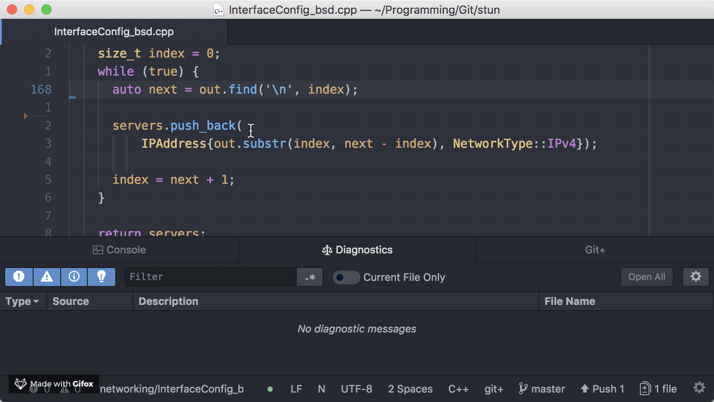
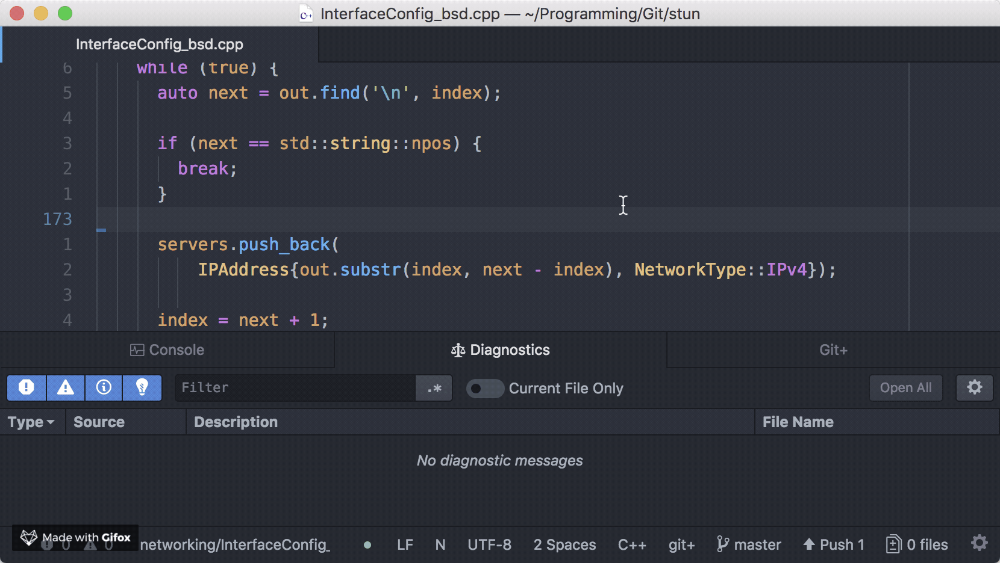
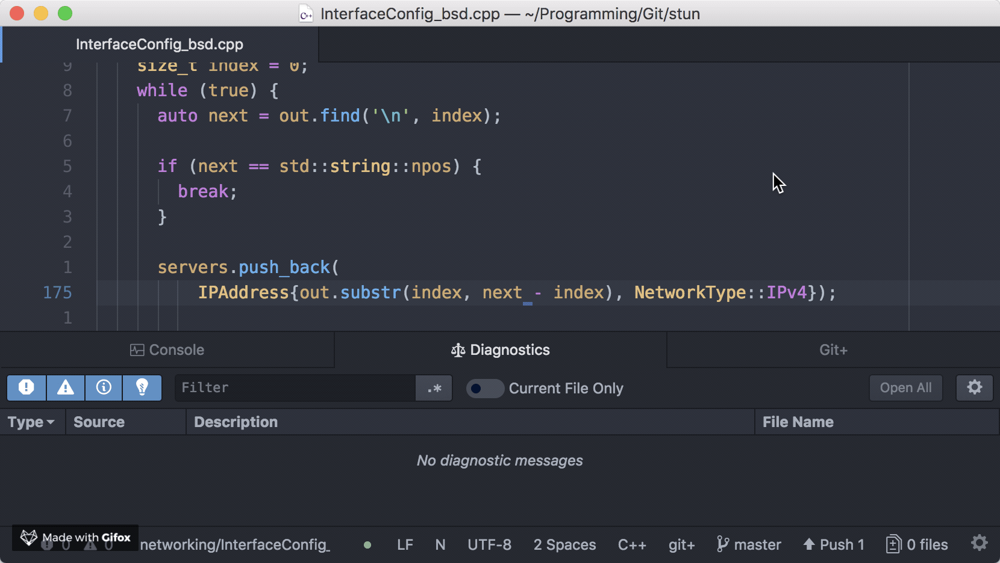

# Atom IDE - ccls

This package provides an integration of the ccls C++ language server with Atom's languageclient.

# Installation

First, download and build [ccls](https://github.com/MaskRay/ccls).

Then, you need to install both this package (`ide-ccls`) and the base Atom IDE UI package (`atom-ide-ui`). You can either install them from the Atom GUI, or from the command line:

```
apm install atom-ide-ui ide-ccls
```

Once you finish these two steps, if your `ccls` binary is available on your `PATH`, you should be good to go. Otherwise, just go into `ide-ccls`'s settings panel, and fill in the full path to your `ccls` binary.

# Features

`ide-ccls` exposes the following features powered by ccls and Atom IDE UI:

## Real-time Diagnostic and Auto-completion

`ide-ccls` provides diagnostic and auto-completion information from ccls as you type.



## Go-to Declarations/Definitions

Use hyper-click (Command+Click on macOS, Control+Click on Linux/Windows) to go to declarations/definitions.



## Type and Signature Help

Hovering on top of variables and functions shows their types/signatures. You can also pin a signature panel for easy access.


